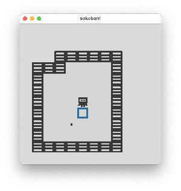

# sokoban 推箱子

* 参考文件 [Rust sokoban](https://sokoban.iolivia.me/)




首先先思考下如何做

1. 创建地图，按照格子放置角色，箱子，墙，障碍物
2. 用户控制角色可以移动，每次移动一个单位格子
3. 用户角色可以推动箱子
4. 用户和箱子撞墙不可移动
5. 箱子到目标后计分，所有的目标被箱子重叠后结束
6. 记录用户的步数

可以看出用户每次移动只有一个方向，只能移动一个格子，移动的方向的下个格子必须为可以移动的位置（没有其他的物品阻碍），
推动箱子的时候则移动向量叠加的箱子上，这是因为箱子本身可以移动，用户和箱子就成为了一个移动的整体，可以看作是用户控制
的角色的延伸，则箱子的移动的下个位置必须可以移动。那么我们地图商的每个格子是否可以移动取决于所在座标上有没有不可移动的物品。


```bob
o-> 座标

      ^ y
      |
      |
      o - - - - -# [2,2]
      |          :
      o - - o    :
-x    |     |    :
<-----*-----o----o---> x
      | [0, 0]
      |
      v -y


o-> 布局

 .-----+-----+-----.
 |     |     |     | 
 |     |     |[2,2]| 
 +-----+-----+-----+ 
 |     |     |     | 
 |     |[1,1]|     | 
 +-----+-----+-----+ 
 |     |     |     | 
 |[0,0]|     |     | 
 '-----+-----+-----' 

```


## ecs 

**实体**

| 实体     | 名称     | 组件                 |
| -------- | -------- | -------------------- |
| Player   | 用户     | 位置,可渲染,可移动   |
| Wall     | 墙       | 位置,可渲染,不可移动 |
| Floor    | 地板     | 位置,可渲染          |
| Box      | 箱子     | 位置,可渲染,可移动   |
| Box spot | 箱子目标 | 位置,可渲染          |

**组件**

| 组件       | 名称     | 定义 |
| ---------- | -------- | ---- |
| Position   | 位置     |
| Renderable | 可渲染   |
| Movable    | 可移动   |
| Immovable  | 不可移动 |

**资源**

**事件**

**系统**

* 地图加载
* 用户移动
  * 推动箱子
* box spot 终点检测
* 坐标转换
* 组件渲染
* 计分器
* 事件监听


